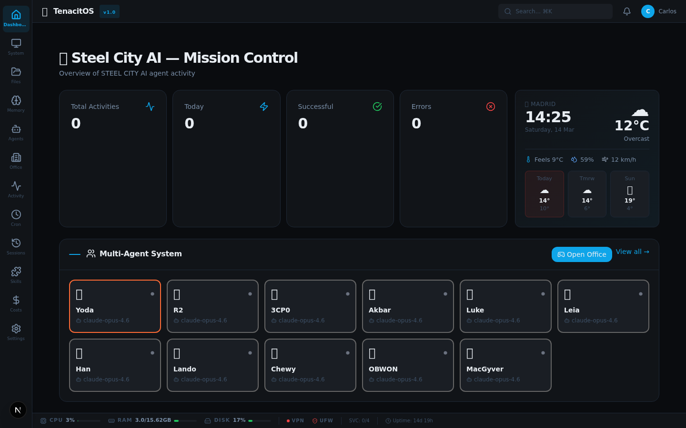
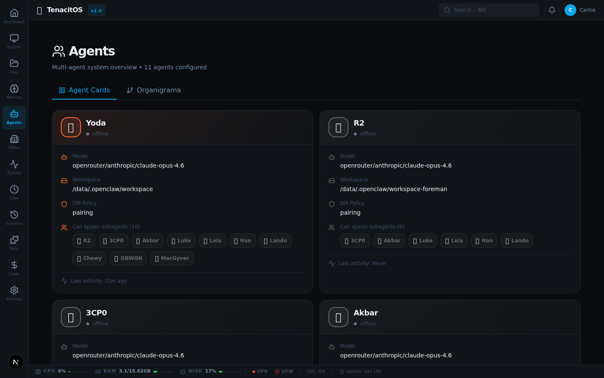
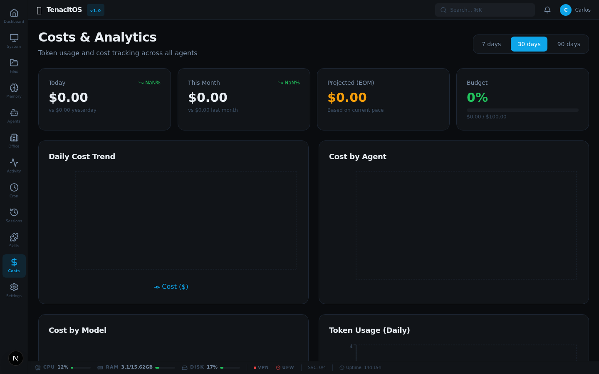
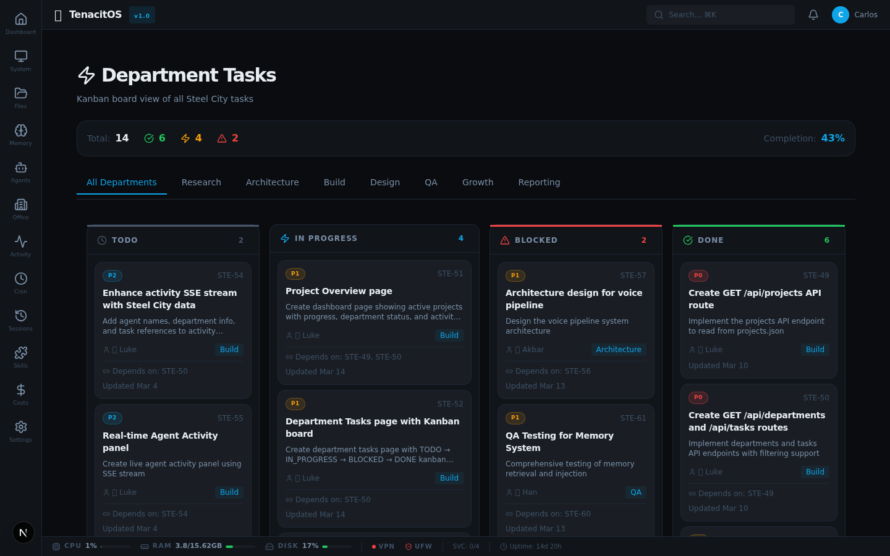

# Steel City AI — Mission Control

A real-time dashboard and control center for [OpenClaw](https://openclaw.ai) AI agent instances. Built with Next.js, React 19, and Tailwind CSS v4.

> **Mission Control** lives inside your OpenClaw workspace and reads its configuration, agents, sessions, memory, and logs directly from the host. No extra database or backend required — OpenClaw is the backend.

---

## Features

- **📊 System Monitor** — Real-time VPS metrics (CPU, RAM, Disk, Network) + PM2/Docker status
- **🤖 Agent Dashboard** — All agents, their sessions, token usage, model, and activity status
- **💰 Cost Tracking** — Real cost analytics from OpenClaw sessions (SQLite)
- **⏰ Cron Manager** — Visual cron manager with weekly timeline, run history, and manual triggers
- **📋 Activity Feed** — Real-time log of agent actions with heatmap and charts
- **🧠 Memory Browser** — Explore, search, and edit agent memory files
- **📁 File Browser** — Navigate workspace files with preview and in-browser editing
- **🔎 Global Search** — Full-text search across memory and workspace files
- **🔔 Notifications** — Real-time notification center with unread badge
- **🏢 Office 3D** — Interactive 3D office with one desk per agent (React Three Fiber)
- **📺 Terminal** — Read-only terminal for safe status commands
- **🔐 Auth** — Password-protected with rate limiting and secure cookie
- **🏭 Steel City Branding** — Custom theme for the Pittsburgh AI team

---

## Screenshots

**Dashboard** — activity overview, agent status, and weather widget



**Agents** — all Steel City AI agents with their status



**Costs & Analytics** — daily cost trends and breakdown per agent



**Departments** — task boards organized by team



---

## Quick Start

### 1. Clone into your OpenClaw workspace

```bash
cd /data/.openclaw/workspace/projects/mission-control-dashboard
git clone https://github.com/SteelCity-ai/mission-control.git
cd mission-control
npm install
```

### 2. Initialize data files

```bash
cp data/cron-jobs.example.json data/cron-jobs.json
cp data/activities.example.json data/activities.json
cp data/notifications.example.json data/notifications.json
cp data/configured-skills.example.json data/configured-skills.json
cp data/tasks.example.json data/tasks.json
```

### 3. Start the development server

```bash
PORT=3456 npm run dev
# → http://localhost:3456
```

### 4. Login

Navigate to `http://localhost:3456` and login with:

- **Password:** `steel-city-2026`

> **Note:** Change the `ADMIN_PASSWORD` in `.env.local` for production use.

---

## Documentation

| Document | Description |
|----------|-------------|
| [USER-GUIDE.md](./docs/USER-GUIDE.md) | Complete user guide for Mission Control |
| [PROJECT-REPORT.md](./docs/PROJECT-REPORT.md) | Project completion report and timeline |
| [BRANCHING.md](./docs/BRANCHING.md) | Git branching strategy and conventions |
| [CONTRIBUTING.md](./CONTRIBUTING.md) | How to contribute to this project |

---

## Tech Stack

| Layer | Tech |
|---|---|
| Framework | Next.js 16 (App Router) |
| UI | React 19 + Tailwind CSS v4 |
| 3D | React Three Fiber + Drei |
| Charts | Recharts |
| Icons | Lucide React |
| Database | SQLite (better-sqlite3) |
| Runtime | Node.js 22 |

---

## Configuration

### Environment Variables

Edit `.env.local` to configure:

```env
# Auth (required)
ADMIN_PASSWORD=your-secure-password
AUTH_SECRET=your-random-32-char-secret

# OpenClaw paths
OPENCLAW_DIR=/data/.openclaw
OPENCLAW_WORKSPACE=/data/.openclaw/workspace

# Branding
NEXT_PUBLIC_AGENT_NAME=Steel City AI
NEXT_PUBLIC_AGENT_EMOJI=🏭
NEXT_PUBLIC_COMPANY_NAME=STEEL CITY AI
NEXT_PUBLIC_APP_TITLE=Steel City AI — Mission Control
```

### Agent Branding

Agents can define their own visual appearance in `openclaw.json`:

```json
{
  "id": "main",
  "name": "Yoda",
  "ui": {
    "emoji": "🧙",
    "color": "#FFB612"
  }
}
```

---

## Production Deployment

### PM2 (recommended)

```bash
npm run build

pm2 start npm --name "mission-control" -- start
pm2 save
pm2 startup
```

---

## Contributing

Contributions are welcome! Please read our [contributing guidelines](./CONTRIBUTING.md) and read the [branching strategy](./docs/BRANCHING.md) before submitting PRs.

1. Fork the repo
2. Create a feature branch (`git checkout -b feat/my-feature`)
3. Keep personal data out of commits (use `.env.local` and `data/`)
4. Write clear commit messages
5. Open a PR

---

## License

MIT — see [LICENSE](./LICENSE)

---

## Links

- [GitHub Repository](https://github.com/SteelCity-ai/mission-control)
- [Linear Project](https://linear.app/steelcity-ai/project/mission-control-dashboard)
- [OpenClaw](https://openclaw.ai) — the AI agent runtime this dashboard is built for
- [OpenClaw Docs](https://docs.openclaw.ai)

---

*Built by the Steel City AI Team — Pittsburgh's finest autonomous workforce* 🏭