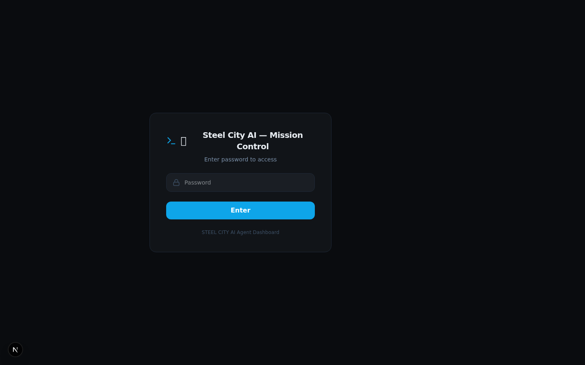

# Steel City AI — Mission Control User Guide

> **Version:** 1.0  
> **Last Updated:** 2026-03-14

---

## What is Mission Control?

Mission Control is your real-time dashboard and control center for the Steel City AI agent team. It gives you a bird's-eye view of all your AI agents—their status, activity, costs, and more. Think of it as mission control for your autonomous workforce.

### What You Can Do with Mission Control

- **Monitor** all 11 Steel City AI agents in real-time
- **Track** token usage and costs across every agent
- **Orchestrate** workflows and trigger agent actions
- **Search** agent memories and workspace files
- **Manage** cron schedules and automated tasks
- **View** detailed logs and activity history

---

## How to Access Mission Control

### URL

Mission Control is accessible at:

```
http://your-server:3456
```

If you're running it locally for development:

```
http://localhost:3456
```

### Login

1. Navigate to the URL above
2. Enter the admin password: `steel-city-2026`
3. Click **Login** to access the dashboard



> **Security Note:** Change the `ADMIN_PASSWORD` in your `.env.local` file for production deployments.

---

## Dashboard Overview

When you log in, you'll see the main dashboard with several key sections:


### Key Sections

| Section | Description |
|---------|-------------|
| **Header** | Shows "Steel City AI — Mission Control" with the 🏭 emoji |
| **Agent Status Cards** | Real-time status of each agent (Yoda, R2, Luke, etc.) |
| **Activity Feed** | Recent actions taken by your agents |
| **Weather Widget** | Local weather for your agent's "location" |
| **Quick Stats** | Token usage, active sessions, and cost summaries |

### The Sidebar

The left sidebar provides quick navigation to all pages:

- 🏠 **Dashboard** — Main overview
- 🤖 **Agents** — Agent roster and details
- 📊 **Sessions** — All active and past sessions
- 💰 **Costs** — Cost tracking and analytics
- ⚡ **System** — CPU, RAM, disk, network metrics
- 🔔 **Activity** — Real-time activity feed
- ⏰ **Cron** — Scheduled task manager
- 📁 **Files** — Workspace file browser
- 🔍 **Search** — Global search across files and memories
- 🧠 **Memory** — Agent memory browser
- ⚙️ **Settings** — Configuration options

---

## Department Tasks

The **Departments** page shows task boards organized by team:


### Viewing Tasks

1. Click **Departments** in the sidebar
2. You'll see columns for each department:
   - **Operations** (Yoda, R2, OBWON)
   - **Research** (3CP0)
   - **Architecture** (Akbar)
   - **Build** (Luke, MacGyver)
   - **Design** (Leia)
   - **QA** (Han)
   - **Growth** (Lando)
   - **Reporting** (Chewy)

### Filtering Tasks

- Use the **search box** at the top to filter tasks by name
- Each department column shows its task count
- Tasks are color-coded by priority (if configured)

### Task Details

Click on any task card to see:
- Task title and description
- Assignee (which agent)
- Status (todo, in-progress, done)
- Due date (if set)

---

## Workflow Orchestration

The **Workflows** page lets you trigger automated workflows:

 <!-- Screenshot pending -->

### How to Kick Off a Workflow

1. Navigate to **Workflows** in the sidebar
2. Browse available workflows (e.g., "Daily Report", "Deploy Agent", etc.)
3. Click the **Run** or **Play** button on the workflow you want to execute
4. Confirm the action if prompted
5. Monitor progress in the **Activity** feed

### Workflow Types

| Workflow | Description |
|----------|-------------|
| **Daily Standup** | Generates status report for all agents |
| **Data Collection** | Collects usage metrics and cost data |
| **Memory Backup** | Backs up agent memory files |
| **Agent Health Check** | Verifies all agents are responsive |

### Viewing Workflow History

- Recent workflow runs appear in the **Activity** page
- Each entry shows: workflow name, triggered by, timestamp, and status (success/failure)

---

## Memory Viewer

The **Memory** page lets you explore what your agents are "thinking":

 <!-- Screenshot pending -->

### Searching Agent Memories

1. Click **Memory** in the sidebar
2. You'll see a list of all agent workspaces
3. Click on an agent (e.g., "Yoda", "R2") to view their memory files
4. Common memory files include:
   - `MEMORY.md` — Long-term memories
   - `memory/YYYY-MM-DD.md` — Daily notes
   - `SOUL.md` — Agent identity and personality
   - `USER.md` — User context and preferences

### Searching Across All Memories

1. Click **Search** in the sidebar instead
2. Enter your search query in the search box
3. Results show matches from:
   - Agent memory files
   - Workspace files
   - Log files
4. Click any result to preview the content

### Editing Memory

> ⚠️ **Caution:** Be careful when editing agent memories directly. Changes can affect agent behavior.

To edit:
1. Navigate to the memory file
2. Click the **Edit** button (if available)
3. Make your changes
4. Click **Save**

---

## Troubleshooting Common Issues

### "Gateway not reachable" / Agent data missing

**Problem:** Dashboard shows no agent data or shows connection errors.

**Solution:**
```bash
# Check if OpenClaw gateway is running
openclaw status

# If not running, start it
openclaw gateway start
```

### "Database not found" (Cost Tracking)

**Problem:** Cost tracking shows empty or shows errors.

**Solution:**
```bash
# Run the usage collection script
npx tsx scripts/collect-usage.ts
```

### Login fails / "Invalid credentials"

**Problem:** Can't log in to Mission Control.

**Solution:**
1. Check your `ADMIN_PASSWORD` in `.env.local`
2. Make sure you've run `npm install` and the server is running
3. Clear browser cookies and try again

### Page doesn't load / 404 errors

**Problem:** Certain pages return errors.

**Solution:**
```bash
# Restart the development server
PORT=3456 npm run dev

# Or for production, rebuild and restart
npm run build
pm2 restart mission-control
```

### Build errors after pulling updates

**Problem:** Getting errors after updating the project.

**Solution:**
```bash
# Clean build and reinstall dependencies
rm -rf .next node_modules
npm install
npm run build
```

### Port already in use

**Problem:** Another process is using port 3456.

**Solution:**
```bash
# Find what's using the port
lsof -i :3456

# Kill the process or use a different port
PORT=3457 npm run dev
```

---

## Screenshots Reference

| Page | Screenshot File |
|------|-----------------|
| Login | `08-login-themed.png` |
| Dashboard | `09-dashboard-themed.png` |
| Agents | `10-agents-themed.png` |
| Costs | `11-costs-themed.png` |
| Departments | `13-departments-kanban.png` |
| Sessions | `05-system.png` (similar) |

---

## Getting Help

- **GitHub Issues:** [https://github.com/SteelCity-ai/mission-control/issues](https://github.com/SteelCity-ai/mission-control/issues)
- **OpenClaw Docs:** [https://docs.openclaw.ai](https://docs.openclaw.ai)
- **Internal Support:** Reach out to #steel-city-dev on Discord

---

*Built with ❤️ by the Steel City AI Team*